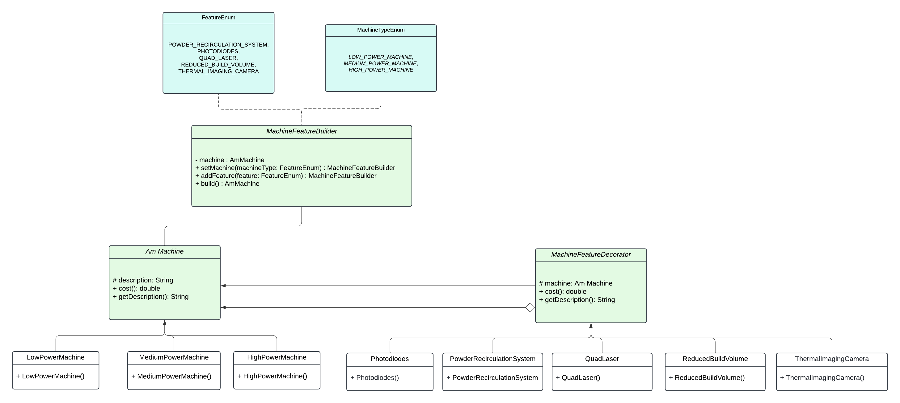

# Alloyed Coding Challenge

## Part 1: Design Patterns and Principles

This part used a decorator design pattern, which is used to add new functionalities to the existing classes without altering their structure. 

Single Responsibility Principle and Open/Closed Principle are applied. The Single Responsibility Principle is that a class, module, or function should only have one reason to change, or one job to do. The Open/Closed Principle is that a class should be open for extension but closed for modification.

### Class Diagram

## Part 2: Alloy Optimisation

This part includes the main functionality for finding the optimal alloy with the best creep resistance for a given cost.

### Prerequisites

- Java 11 or higher
- Maven
- JUnit 5

### Building the Project

To build the project, run the following command:

```sh
mvn clean install
```

### Running the tests

To run the tests, execute the following command:

```sh
mvn test
```

### Usage

In the main class `AlloyOptimizationApp`, I include the use case of the nickel alloy from the provided data. It generates the optimal alloy composition and its creep resistance. The creep resistance is also verified in the unit test.

### Author

- Siyue Yu
